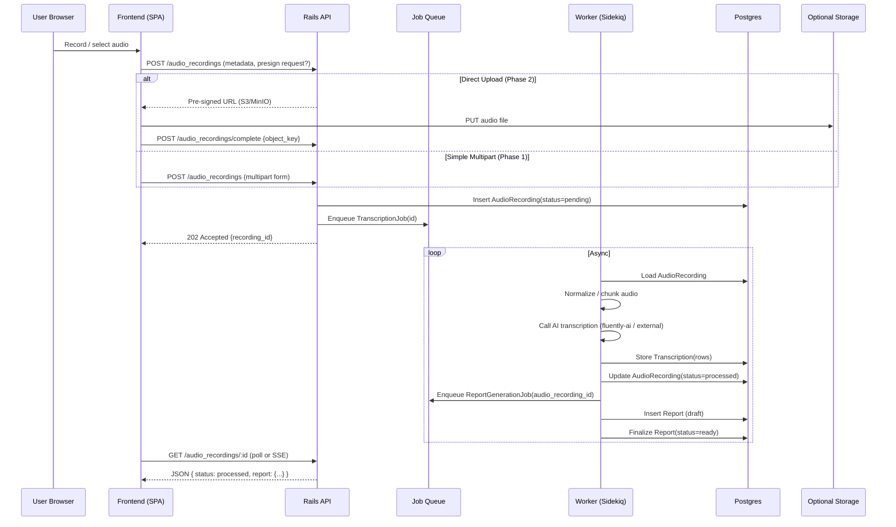

# Fluently System Design

Version: 0.3 (Consolidated)  
Last Updated: 2025-09-12

## 1. Goals

- Ship a lean first version (marketing site + web app + Rails API) without blocking future scale.
- Support multi-tenant SaaS from day one (soft isolation) with a clear upgrade path.
- Keep operational footprint small (Railway) while enabling gradual hardening: observability, background jobs, object storage (optional Phase 2), billing, analytics.

## 2. High-Level Architecture

```mermaid
flowchart LR
  subgraph Browser
    UI[React/Vite SPA]
  end

  UI -->|HTTPS JSON (JWT)| API[Rails API]
  API --> DB[(Postgres)]
  API --> CACHE[(Redis)]
  API --> QUEUE[[Sidekiq Jobs]]
  QUEUE --> CACHE
  QUEUE --> DB
  subgraph OptionalPhase2
    STORE[(Object Storage S3/MinIO)]
  end
  API -. store/retrieve .-> STORE

  API --> OBS[(Logging / Metrics)]
```

### Components

| Component                         | Purpose                                    | Notes                                                                      |
| --------------------------------- | ------------------------------------------ | -------------------------------------------------------------------------- |
| Web Frontend (Vite/React)         | User interaction layer                     | Deployed as static assets + edge CDN (Railway static or similar).          |
| Rails API (API-only)              | Core business logic & data access          | Provides REST+JSON (GraphQL optional later).                               |
| Postgres                          | Primary relational store + job queue       | Single shared DB; `tenant_id` column on multi-tenant tables.               |
| Solid Queue                       | Background job processing (Rails 8 native) | Uses Postgres; queues for transcription, report generation, notifications. |
| Object Storage (Optional Phase 2) | Audio blobs, reports, datasets             | Start with local disk in dev; add S3/MinIO later.                          |
| Mail (SMTP / Mailer Service)      | Transactional email                        | Mailcatcher in dev.                                                        |
| Observability Stack               | Logging, metrics, tracing                  | Phase 1: Rails + structured logs; Phase 2: OpenTelemetry exporter.         |
| Feature Flags (Future)            | Progressive delivery                       | LaunchDarkly / Flipper optional.                                           |

## 3. Audio Processing Sequence (Current Feature Focus)



Polling initially; upgrade to Server-Sent Events or WebSockets for push notifications later.

## 4. Multi-Tenancy Strategy (Summary)

See `MULTI_TENANCY.md` for detail.

- Phase 1: Shared schema + `tenant_id` per row.
- Phase 2: Optional RLS + selective schema/db isolation.
- All background jobs carry explicit `tenant_id`.

## 5. Domain Model (Early Sketch)

- Tenant (has_many Users, Subscription)
- User (belongs_to Tenant)
- AudioRecording (belongs_to Tenant, User)
- Transcription (belongs_to AudioRecording)
- Report (belongs_to Tenant, User; references transcription snapshot)
- RefreshToken / Token (if persisted)

## 6. Background Processing

Solid Queue (Rails 8 native, see `JOBS_AND_PROCESSING.md`). Queues: `critical`, `default`, `low`.
Use built-in exponential retry; dashboard at `/admin/solid_queue`.
Idempotency via job arguments or `perform_unique_by` (audio_recording_id + pipeline version).

## 7. Caching & Performance

- HTTP: ETag + Last-Modified where safe.
- Rails cache: use Solid Cache (Postgres-backed) for transient aggregates.
- DB: Use composite indexes `(tenant_id, created_at)` on high-volume tables.
- Future: Add read replica before sharding.

## 8. Object Storage (Optional – Phase 2)

| Why               | Deferred Until                | Notes                       |
| ----------------- | ----------------------------- | --------------------------- |
| Large audio files | Real user volume / >5GB local | Local disk ok early.        |
| Generated reports | DB size / export frequency    | Small HTML can live inline. |
| Model artifacts   | Fine-tuning stage             | Skip until needed.          |

Abstraction: `StorageProvider` interface -> `LocalDiskStorage` then S3/MinIO.

## 9. Security & Compliance (MVP)

- TLS via platform.
- JWT access (15m) + refresh HttpOnly cookie (30d, rotation).
- Password hashing: Argon2id preferred; bcrypt fallback.
- Rate limiting on auth endpoints (Redis sliding window).
- Audit log (Phase 2) for auth + exports.
- Secret management: Railway variables; no secrets in repo.

## 10. Observability & Ops

Phase 1: structured JSON logs, request timing, error monitoring (Sentry).  
Phase 2: OpenTelemetry traces, metrics (RED + custom domain counts).  
Include `tenant_id` and `request_id` in all logs.

## 11. Deployment (Railway)

Services: `frontend` (static), `api` (web), `worker` (sidekiq).  
Add-ons: Postgres 16, Redis 7.  
Migrations: run as pre-deploy job or one-off exec.  
Container image reused between web & worker with different commands.

## 12. Scaling Path

| Stage             | Trigger            | Action                                |
| ----------------- | ------------------ | ------------------------------------- |
| 0 Prototype       | <100 users         | Single API container + DB + Redis     |
| 1 Early Growth    | p95 > 400ms        | Scale API horizontally; CDN static    |
| 2 Intensive Media | Storage >5GB local | Introduce S3/MinIO + async upload     |
| 3 Enterprise      | Isolation request  | Migrate tenant to dedicated schema/DB |
| 4 Observability   | Debug difficulty   | Add tracing + dashboards              |

## 13. Tech Choices Rationale

- Rails 8 API-only: mature, productive, multi-tenancy patterns well-known.
- Sidekiq: performance + ecosystem.
- Redis: shared infra for queue + caching + rate limit.
- React/Vite: fast iteration, static deploy.
- JWT + refresh: stateless horizontal scale.

## 14. Risks & Mitigations

| Risk                 | Impact             | Mitigation                                 |
| -------------------- | ------------------ | ------------------------------------------ |
| Token leakage        | Account compromise | HttpOnly refresh, rotate, minimal scopes   |
| N+1 queries          | Latency            | Bullet gem dev, add eager loads + indexes  |
| Missing tenant scope | Data leak          | TenantScoped concern + tests + (later) RLS |
| Cost creep           | Burn               | Phase gating, infra right-sizing           |
| Vendor lock-in       | Medium             | Portable Docker + standard libs            |

## 15. Open Questions

- Billing provider selection & timeline.
- LLM provider redundancy (OpenAI + fallback?).
- Data retention & anonymization policies.

## 16. Next Steps

- Scaffold backend (Rails 8) with foundational models.
- Implement audio upload endpoint (multipart) + enqueue job.
- Add polling endpoint & status updates.
- Introduce SSE for real-time status (Phase 2).

---

Canonical system design doc (v0.3). Future edits recorded via ADRs.
